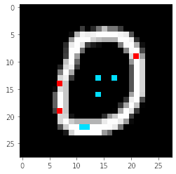
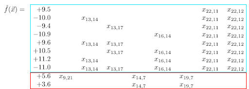

# Deriving Multi-layer Scaffolding of Compositional Neural Networks from Existing, Monolithic Networks

### Researcher

Zachary Rowland

CPS 491 -- Capstone II

Dr. Phu Phung

### Company Mentor

Matthew Clark, Principal Scientist

Galois

444 E 2nd Street

Dayton, OH 45402

## Project Overview

From the humble linear regression to today's deep neural networks, learning systems have always been essential tools for data analysis. Neural networks have proven themselves capable of learning to perform complex tasks such as image classification. However, the inner workings of neural networks remains a confusing mess. This research presents a new technique for optimally compressing a neural network into a small polynomial approximation. Compressing neural networks into smaller mathematical equations can offer insight into the workings of neural network approximation and the nature of complex classification and regression tasks.

## Evolutionary Equation Learning

The algorithm was tested using the MNIST dataset, a set of 70,000 greyscale images of handwritten digits. It relies on an evolutionary process of mutation and selection on a group of candidate polynomials. The images below show a 10-term 5th-degree polynomial over eight of the input pixels that was learned through this algorithm. This polynomial approximates the behavior of the original neural network with a correlation coefficient of nearly 0.8.

<video width="1080" height="720" controls>
  <source src="vid/demo.mp4" type="video/mp4">
  Video cannot be displayed. Browser must support MP4 video display.
</video>

LinkedIn: https://www.linkedin.com/in/zachary-rowland-771930172/

